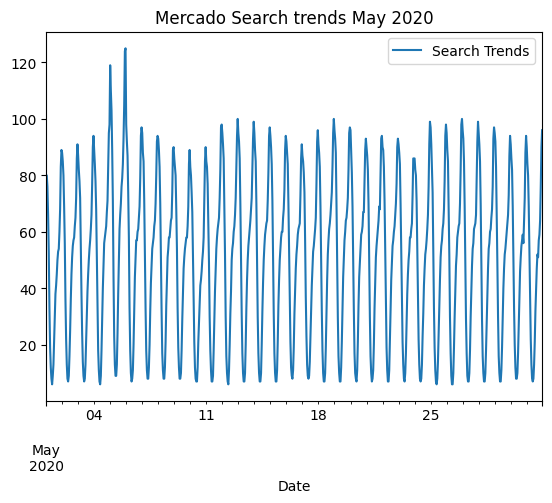
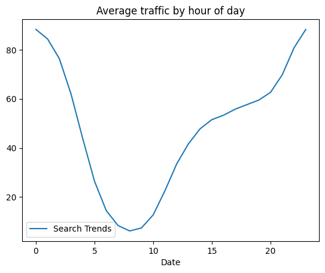
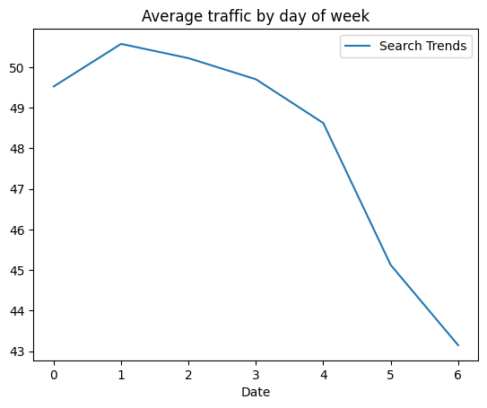
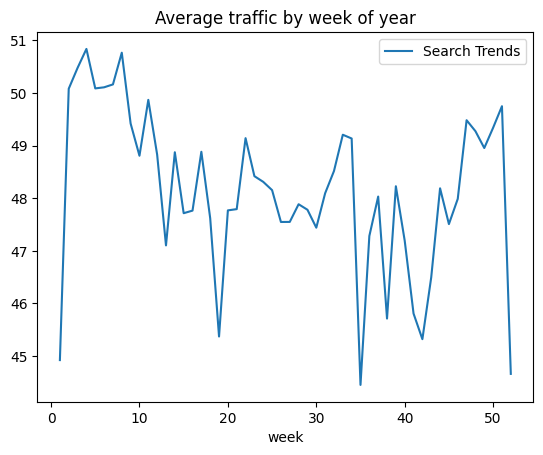
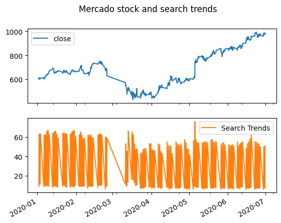
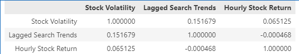
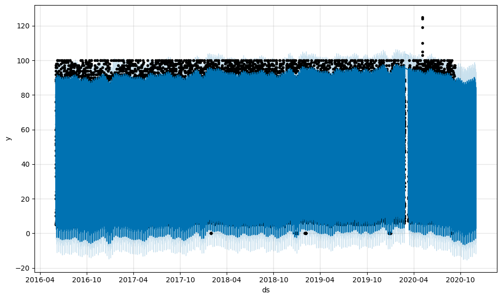
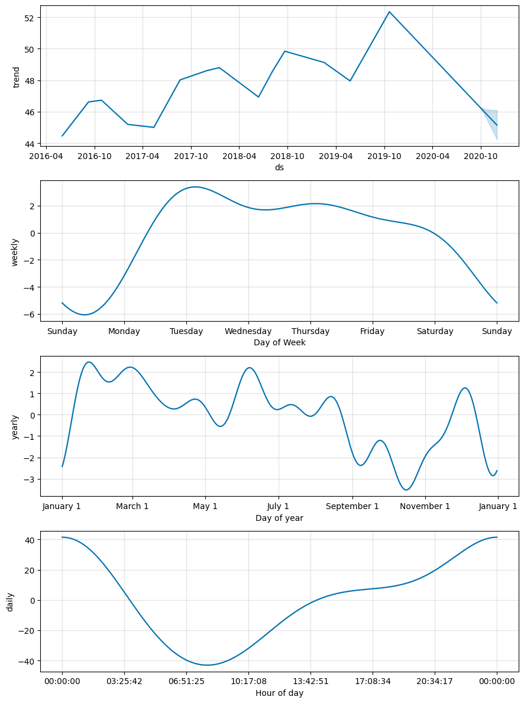

## Prophet Challenge questions extracted and shown here

**Question:** Did the Google search traffic increase during the month that MercadoLibre released its financial results?

**Answer:** Reviewing the data for the month of May does indicate a jump in searches during first weeks of the month, indicating the published results possibly influenced this

**Question:** Are there any time based trends that you can see in the data?

**Answer:** Hourly data indicates higher search rates early in day and end of day. Daily search data indicates higher searches during beginning of week. Weekly data over a year trends show relative consistent performance with minimal variance from high to low indicators

**Question:** Do both time series indicate a common trend that’s consistent with this narrative?

**Answer:** In truth, our evidence of a common trend between search activity and stock price is pretty limited. It does appear generally however that the low point for Mercado Libre's stock price, late March to early April, did coincide with lower search activity for the firm. Search activity does pick up along with its stock price, although the stock price from mid-April onward definitively outpaces search interest.

There's one important thing to note: if you zoom in both graphs to the spike around May 5th, 2020, you'll find the date of the company's earnings release to the public. It looks like search traffic for the firm spiked about two hours before the firm's stock price spiked. This could indicate a predictable pattern (can Google Searches predict the stock price?), but an alternative explanation might just be that people tend to search for more information about the firm right before an earnings announcement gets released. We'd need to do a little more time-series research to see which explanation best fits the data.

**Question:** Does a predictable relationship exist between the lagged search traffic and the stock volatility or between the lagged search traffic and the stock price returns?

**Answer:** If we read down the second column (or read along the second row), we see that there's a slight negative correlation between searches for the firm and its subsequent stock volatility. More searches (slightly) tend to indicate less near-term hourly stock risk for the firm.

On the other hand, there's a positive correlation between search activity in one hour and stock returns in the next: as search activity goes up, so will the firm's stock price in the short term. This effect is very weak though, only half the size of the effect on stock volatility. With the correlation so close to zero, some might also say that there's almost no relationship between these two variables whatsoever, and that the small findings that we do have could be just due to chance. While there's no required threshold when looking at correlation between stock returns and the variables used to predict them, it does tend to be that correlations in this context tend to be very low across the board. It's hard to predict the market!

**Question:**  How's the near-term forecast for the popularity of MercadoLibre?

**Answer:** The near term forecast follows the typical trend shown, but does indicate that popularity is dipping instead of increasing at this time.

**Question:** What time of day exhibits the greatest popularity?

**Answer:** According to the Hour of day chart above it looks like greatest number happens @ 00:00:00

**Question:** Which day of week gets the most search traffic?
   
**Answer:** According to the Day of week chart above it reflects that Tuesday gets the highest requests

**Question:** What's the lowest point for search traffic in the calendar year?

**Answer:** Reading the Day of year chart above indicates that October shows the lowest point for traffic

